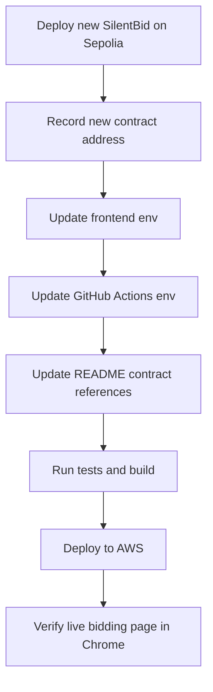

# Demo Auction Redeploy Task

目标：为线上公网 demo 准备一个新的、未结束的 Sepolia SilentBid 拍卖合约，并把前端、README、部署流水线统一指向新地址。

## 当前事实

| 项 | 值 |
|---|---|
| 线上公网 | `http://3.21.154.136/` |
| 当前线上合约 | `0xAB06CB9cddC96B4c8725F3298548e56CbC10994d` |
| 当前 owner | `0x68269ebf49B17232A806E4CAf126b340064D24ad` |
| 当前状态 | `ended = true`, `isActive = false`, `bidCount = 8` |
| 当前结束时间 | `2026-05-07 18:24:00 CST` |
| README 旧地址 | `0x616239Fd271BD7A4FAc343ABDD90e51244077b47` |

## 推荐方案

部署一个新的 `SilentBid` 合约作为 live demo，而不是重开旧合约。

## 拆分任务

| 状态 | 任务 | 产出 |
|---|---|---|
| [ ] | 部署新 Sepolia 合约，建议 duration 3-7 天 | 新合约地址 |
| [ ] | 告知人类新合约地址 | 人类可手动改 `.env` |
| [ ] | 如 Codex 可访问本地 env，则同步修改 `frontend/.env` | `VITE_CONTRACT_ADDRESS=<new-address>` |
| [ ] | 更新 `.github/workflows/deploy.yml` | `VITE_CONTRACT_ADDRESS: "<new-address>"` |
| [ ] | 更新 `frontend/src/deploy.json` | `address` 字段为新地址 |
| [ ] | 更新 `README.md` | 合约表、Etherscan 链接、快速开始 env 示例 |
| [ ] | 视情况更新 `README.en.md` / `SUBMISSION.md` | 避免提交材料引用旧地址 |
| [ ] | 保持线上 `VITE_ENABLE_TEST_CONTROLS` 不开启 | 公网不暴露测试按钮 |
| [ ] | 运行验证 | `npm test`, `cd frontend && npm run test` |
| [ ] | 推送触发流水线 | GitHub Actions deploy 通过 |
| [ ] | Chrome 验证公网 | `/lobby` 显示进行中，`/auction/live` 可正常竞价 |

## 环境变量规则

| 文件 | Git 状态 | 处理方式 |
|---|---|---|
| `.env` | 未跟踪，本机私密 | 不提交；必要时只本地改 |
| `frontend/.env` | 未跟踪，本机私密 | 不提交；必要时只本地改 |
| `.env.example` | 已跟踪 | 只放占位示例 |
| `frontend/.env.example` | 已跟踪 | 可写推荐变量名，不写私钥 |
| `.github/workflows/deploy.yml` | 已跟踪 | 线上构建实际使用的合约地址 |

## 注意事项

- `VITE_ENABLE_TEST_CONTROLS=true` 只适合本地测试；公网 demo 不建议开启。
- 当前前端不是多拍卖品系统，`/auction/live` 实际读取一个 live contract。
- 新合约地址确定后，README 里所有 `0x6162...7b47` 和已过期 live 地址都要统一检查。
- 浏览器验证不能只看 `curl`，需要用 Chrome 打开 `http://3.21.154.136/auction/live`。
