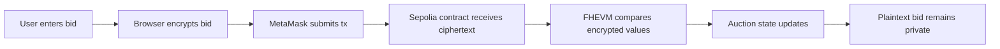
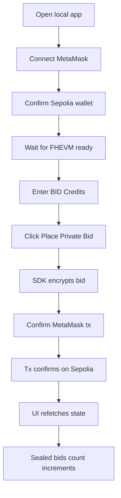
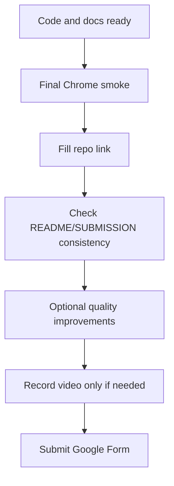

# SilentBid PRD

## 1. Product Overview

| Item | Detail |
|---|---|
| Product | SilentBid |
| Tagline | Privacy-preserving sealed-bid auction on Zama FHEVM |
| Audience | Zama bounty judges, Web3 developers, privacy-auction evaluators |
| Current stage | Working hackathon demo |
| Network | Sepolia |
| Contract | `0xCE06943bF0A1a5bfb409e50b00466abb6fc24F85` |

SilentBid is a sealed-bid auction dApp where users submit encrypted bids from the browser. The smart contract accepts encrypted bid inputs and updates auction state with Zama FHEVM primitives, so bid amounts do not appear as plaintext on-chain.

## 2. Problem Statement

Public blockchain auctions expose every bid. This creates an unfair auction dynamic:

| Problem | Impact |
|---|---|
| Bids are visible in mempool/block explorer | Later bidders can inspect earlier bids |
| Bid amount is public | Competitors can outbid by the minimum possible amount |
| Auction logic is public but not private | Users must choose between transparency and confidentiality |

SilentBid demonstrates how FHE can preserve auction confidentiality while keeping settlement logic on-chain and verifiable.

## 3. Goals and Non-Goals

### Goals

| Goal | Success signal |
|---|---|
| Prove browser-side encrypted bidding | User can enter BID Credits and create encrypted input with Zama relayer SDK |
| Prove on-chain encrypted processing | Contract accepts encrypted input and compares bids with FHEVM operations |
| Prove real wallet flow | MetaMask confirms a Sepolia transaction |
| Prove UI state refresh | Bid count updates after transaction confirmation |
| Provide judge-ready evidence | README, submission pack, contract address, tx evidence, and tests are available |

### Non-Goals

| Non-goal | Reason |
|---|---|
| Production auction marketplace | Current project is a bounty demo |
| Real payment settlement | Demo uses BID Credits instead of ETH escrow |
| Complex identity/reputation system | Out of scope for privacy-bid proof |
| Fully automated MetaMask E2E | Useful quality improvement, not required for core proof |
| Video-first delivery | Video is lowest priority unless the submission form requires it |

## 4. Target Users

| User | Need | SilentBid value |
|---|---|---|
| Bounty judge | Verify Zama FHEVM usage quickly | Contract, tests, tx evidence, and demo flow are documented |
| Web3 developer | Understand private auction implementation | Shows browser encryption plus FHEVM contract logic |
| Auction participant | Submit a bid without revealing amount | Bid amount is encrypted before reaching the contract |
| Auction owner | End auction and enable result decryption permissions | Owner can close auction through contract flow |

## 5. User Journey

Primary happy path:

1. User opens `http://localhost:5173/`.
2. User connects MetaMask on Sepolia.
3. App initializes Zama relayer SDK.
4. User enters a whole-number bid in BID Credits.
5. User clicks `Place Private Bid`.
6. Browser encrypts the bid and submits encrypted input to the contract.
7. MetaMask confirms the transaction.
8. App refreshes contract state and displays the updated bid count.

## 6. Functional Requirements

| ID | Requirement | Current status |
|---|---|---|
| FR-1 | Connect and disconnect MetaMask wallet | Done |
| FR-2 | Read contract state: owner, ended, active state, bid count | Done |
| FR-3 | Initialize Zama FHEVM relayer SDK on Sepolia | Done |
| FR-4 | Accept bid amount as whole `uint32` BID Credits | Done |
| FR-5 | Encrypt bid client-side before contract submission | Done |
| FR-6 | Submit encrypted bid through MetaMask | Done |
| FR-7 | Contract compares encrypted bids and updates encrypted highest bid/winner | Done |
| FR-8 | Refresh bid count and auction state after tx confirmation | Done |
| FR-9 | Show recent `BidSubmitted` events | Done |
| FR-10 | Provide owner-only auction close control | Done |
| FR-11 | Provide trivial bid debug path for development testing | Done |
| FR-12 | Add automated wallet E2E or mocked EIP-1193 test | Pending |

## 7. Technical Requirements

| Layer | Requirement | Implementation |
|---|---|---|
| Smart contract | Solidity auction contract using Zama FHEVM | `contracts/SilentBid.sol` |
| FHE logic | Compare encrypted bid values without plaintext branching | `FHE.gt` and `FHE.select` |
| Client encryption | Encrypt bid in browser before transaction | `@zama-fhe/relayer-sdk` |
| Wallet | Use standard wallet transaction flow | MetaMask + wagmi |
| Network | Use Zama-supported public testnet path | Sepolia + Zama relayer V2 config |
| Frontend | Judge-readable demo UI | React + Vite |
| Validation | Prevent invalid bid values | Whole number from `1` to `4294967295` |
| Verification | Keep reproducible test commands | Root Hardhat tests and frontend checks |

## 8. Acceptance Criteria

| Area | Acceptance criteria | Evidence |
|---|---|---|
| Contract tests | All contract tests pass | `npm test` shows 10 passing |
| Frontend checks | Typecheck, production build, and unit tests pass | `cd frontend && npm run test` shows 10 tests passing |
| Encrypted bid | User can submit encrypted bid through MetaMask on Sepolia | Verified encrypted tx `0xfc54da826c251e17fc6ac6...` |
| State refresh | Bid count updates after confirmed bid | Browser smoke verified count change |
| Contract evidence | Contract address is available to judges | Sepolia address and Etherscan link in README/SUBMISSION |
| Documentation | Reviewer can understand and run the project | README, TESTING, ROADMAP, DEMO_SCRIPT, SUBMISSION, STATUS |

## 9. Risks and Mitigations

| Risk | Impact | Mitigation |
|---|---|---|
| Zama relayer availability | Browser encryption flow may fail | Use official Sepolia relayer V2 config and document dependency |
| Wrong wallet network | SDK initialization or transaction may fail | UI labels Sepolia; README demo flow requires Sepolia |
| FHEVM SDK init order | Public key fetch/encryption may fail | App calls `initSDK()` before `createInstance()` |
| SDK binary values passed incorrectly | Contract write may fail | Convert `Uint8Array` handles/proofs to `0x...` hex |
| Tx confirms but UI stale | Judge may not see successful bid | Refetch contract reads after receipt confirmation |
| Video requirement | Submission may be blocked if form requires video | Keep video as lowest priority but still prepare script |

## 10. Submission Readiness

| Asset | Status | Source |
|---|---|---|
| Contract | Ready | `contracts/SilentBid.sol` |
| Sepolia deployment | Ready | README and SUBMISSION |
| Frontend demo | Ready | `frontend/src/App.tsx` |
| Tests | Ready | `npm test`, `cd frontend && npm run test` |
| Demo script | Ready | `DEMO_SCRIPT.md` |
| Submission copy | Ready | `SUBMISSION.md` |
| Final Chrome smoke | Pending before final submit | Manual MetaMask flow |
| GitHub repository link | Pending | Fill in `SUBMISSION.md` |
| Video | Lowest priority | Required only if form enforces it |
| Google Form | Pending | Human submission step |

## 11. Roadmap

| Priority | Item | Purpose |
|---|---|---|
| P0 | Final Chrome + MetaMask smoke test | Confirm encrypted bid still works before submission |
| P0 | Fill GitHub repository link | Complete submission materials |
| P0 | Recheck README/SUBMISSION contract and tx evidence | Avoid inconsistent judge-facing facts |
| P1 | Add mocked EIP-1193 E2E test | Reduce wallet-flow regression risk |
| P1 | Add connected-state frontend tests | Cover owner controls and disabled states |
| P2 | Add Etherscan links in the UI | Improve judge and developer debugging |
| P2 | Add one-click copy for contract/tx | Improve demo usability |
| P3 | Record 2-minute video | Complete only after core submission materials are stable |

## 12. Open Questions

| Question | Default |
|---|---|
| Does the final Google Form require a video link? | Treat video as lowest priority unless the form enforces it |
| Should E2E use real MetaMask or mocked wallet provider? | Prefer mocked EIP-1193 for deterministic tests |
| Should the UI expose winner reveal in this demo? | Keep out of core demo unless time remains after submission readiness |
