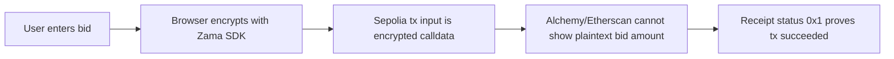
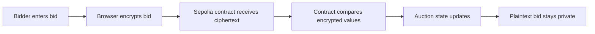
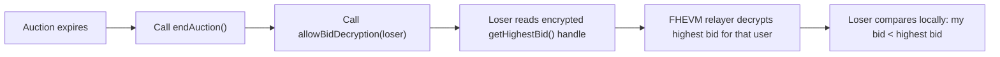
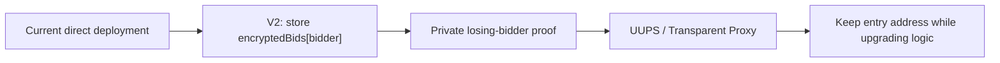

# SilentBid

Privacy-preserving sealed-bid auction on Zama FHEVM.

SilentBid is a working dApp demo where users submit encrypted bids from the browser. The contract accepts encrypted inputs and updates auction state without exposing plaintext bid amounts on-chain.

| Entry | Link |
|---|---|
| Public demo | http://3.21.154.136/ |
| Local development | `http://localhost:5173/` |
| Sepolia contract | https://sepolia.etherscan.io/address/0xCE06943bF0A1a5bfb409e50b00466abb6fc24F85 |

## Privacy Proof On Sepolia

The core evidence is visible on Sepolia through Alchemy Sandbox or Etherscan. The encrypted bid transaction calls the SilentBid contract, but the transaction input is encrypted calldata instead of a plaintext bid amount. The frontend also shows the latest transaction ID produced by the connected wallet inside the SilentBid page, so reviewers can copy it and verify it in Alchemy Sandbox.

| Proof item | Value |
|---|---|
| Network | Sepolia testnet |
| Current demo contract | `0xCE06943bF0A1a5bfb409e50b00466abb6fc24F85` |
| Current auction expiry | `2026-05-14 22:17:00` China time / `2026-05-14 14:17:00 UTC` |
| Current state | `isActive = true`, `ended = false`, `bidCount = 3` |
| Page evidence | Latest wallet transaction ID, with copy button |
| RPC method | `eth_getTransactionByHash` |
| Verification tool | [Alchemy Sandbox](https://sandbox.alchemy.com/) or Sepolia Etherscan |
| Privacy check | `input` is long calldata, not a readable plaintext bid amount |



Verification steps:

1. Open `http://localhost:5173/auction/live`.
2. Connect MetaMask on Sepolia.
3. Submit a sealed bid and confirm it in the wallet.
4. Copy the latest wallet transaction ID from the page's on-chain evidence panel.
5. Open [Alchemy Sandbox](https://sandbox.alchemy.com/).
6. Select `Ethereum Sepolia` and `eth_getTransactionByHash`.
7. Paste the transaction ID and confirm `to` is the SilentBid contract and `input` is long calldata.
8. Switch to `eth_getTransactionReceipt` with the same transaction ID and confirm `status: "0x1"`.

This proves the bid transaction was submitted and confirmed on Sepolia while the plaintext bid amount was not exposed in the transaction input.

## Bounty Context

SilentBid is built for the OpenBuild Zama bounty: [5000U Zama Bounty: Confidential Onchain Finance](https://openbuild.xyz/learn/challenges/2095330503).

| Official requirement | SilentBid response |
|---|---|
| Functioning dApp demo using Zama Protocol | React + Sepolia contract demo |
| Smart contract + frontend implementation | `contracts/SilentBid.sol` + `frontend/` |
| Real-world FHE use case | Confidential sealed-bid auction |
| Clear project documentation | README, submission pack, testing notes, demo script |
| 2-minute human-presented video | Pending final recording |
| Deadline | May 10, 2026 23:59 AOE |

## Why

In a normal blockchain auction, every bid is public. Later bidders can inspect the chain and outbid previous participants by a tiny amount.

SilentBid demonstrates how FHE can improve this pattern:



## What Works Now

| Capability | Status |
|---|---|
| Sepolia deployment | Done |
| MetaMask connection | Done |
| Trivial bid transaction | Done |
| Encrypted bid transaction | Done |
| FHEVM SDK initialization | Done |
| Bid count refresh after tx | Done |
| On-chain evidence: contract + wallet transaction ID | Done |
| Contract tests | 10 passing |
| Frontend checks/tests | 10 passing |

## Contract

| Network | Address |
|---|---|
| Sepolia | `0xCE06943bF0A1a5bfb409e50b00466abb6fc24F85` |

[View contract on Sepolia Etherscan](https://sepolia.etherscan.io/address/0xCE06943bF0A1a5bfb409e50b00466abb6fc24F85)

The on-chain evidence panel shows:

| Field | Purpose |
|---|---|
| Contract address | Confirms which SilentBid contract the frontend is connected to |
| Latest wallet transaction ID | Copies the latest transaction produced by the connected wallet inside the SilentBid page |
| Alchemy Sandbox link | Verifies the transaction via `eth_getTransactionByHash` |

## Tech Stack

| Layer | Choice |
|---|---|
| Contract | Solidity 0.8.24, Zama FHEVM |
| Framework | Hardhat |
| Frontend | React, Vite |
| Wallet/Web3 | MetaMask, wagmi, viem |
| FHE client | `@zama-fhe/relayer-sdk` |
| Network | Sepolia |

## Core FHE Flow

The encrypted bid flow is:

1. User enters a bid amount in BID Credits.
2. Frontend calls `initSDK()` and creates a Zama relayer SDK instance.
3. Frontend creates encrypted input for the auction contract and user address.
4. SDK returns encrypted handles and input proof.
5. Frontend converts SDK `Uint8Array` values to `0x...` hex for wagmi/viem.
6. MetaMask submits the transaction to Sepolia.
7. Contract accepts the encrypted bid and emits `BidSubmitted`.
8. Frontend refetches contract state and updates `Bids`.

When the auction ends, the contract stops accepting new bids and grants result decryption permissions. The current contract stores the highest bid and winner as encrypted handles; it does not write the final price as a plaintext public variable on-chain.

## Current Limitation: Losing-Bidder Verification

The current demo auction expires at `2026-05-14 22:17:00` China time (`2026-05-14 14:17:00 UTC`). Until the auction expires and `endAuction()` is executed, this simulated auction cannot finalize the winner/loser relationship or demonstrate the final price comparison between a losing bidder and the winner.

After expiry, a losing bidder can privately verify the result without revealing their own bid:



| Verification goal | Current version |
|---|---|
| Losing bidder confirms their bid is below the highest bid | Yes, after expiry, by authorizing highest-bid decryption to that bidder |
| Losing bidder keeps their own bid private | Yes, the comparison is local to the bidder |
| Publicly prove a specific loser lost without revealing prices | Not implemented in this version |

The current version does not store each bidder's encrypted bid handle, so it cannot yet generate a public zero-leakage proof such as "my encrypted bid < encrypted highest bid." A future extension would store `encryptedBids[bidder]` and produce a bidder-authorized encrypted boolean result, such as `myBid < highestBid`, after the auction ends.

## Current Limitation: Upgradeability

The current SilentBid demo contract is a direct deployment, not a Proxy / UUPS upgradeable contract. This was intentional for the hackathon submission window: the priority was to keep sealed bidding, the FHEVM flow, wallet interaction, and on-chain evidence stable, without adding last-minute proxy risks around storage layout, initializers, and upgrade permissions.

As a result, the current contract address cannot be upgraded in place to add `encryptedBids[bidder]`, per-bidder losing verification, or a more complete settlement proof. Adding those capabilities requires deploying a new contract version.

Post-hackathon engineering direction:



| Direction | Purpose |
|---|---|
| `encryptedBids[bidder]` | Support per-bidder result verification |
| `myBid < highestBid` encrypted boolean | Let a loser decrypt only whether they lost, without learning the highest price |
| UUPS / Transparent Proxy | Allow future feature expansion without repeatedly changing the entry address |
| Stricter permission model | Separate owner, admin, and bidder boundaries for decryption and upgrades |

## Quick Start

Install dependencies:

```bash
npm install
cd frontend && npm install
```

Create `frontend/.env`:

```bash
VITE_CONTRACT_ADDRESS=0xCE06943bF0A1a5bfb409e50b00466abb6fc24F85
```

Run the frontend:

```bash
cd frontend
npm run dev
```

Open:

```text
http://localhost:5173/
```

Use MetaMask on Sepolia.

The public demo is available at `http://3.21.154.136/`. For full wallet signing and transaction testing, use local desktop Chrome with MetaMask.

## Testing

Contract tests:

```bash
npm test
```

Frontend typecheck, production build, and unit tests:

```bash
cd frontend
npm run test
```

Expected results:

| Check | Expected |
|---|---|
| Hardhat | 10 passing |
| Frontend | typecheck + build + 10 tests passing |

Note: the encrypted browser demo is verified on Sepolia with Zama's hosted relayer. A local Hardhat JSON-RPC endpoint is not a Zama relayer.

## Demo Flow

1. Open `http://localhost:5173/`.
2. Connect MetaMask on Sepolia.
3. Wait for `FHEVM ready`.
4. Enter `100` BID Credits.
5. Click `Place Private Bid`.
6. Confirm in MetaMask.
7. Verify that `Bids` increments after confirmation.
8. Copy the latest wallet transaction ID from the on-chain evidence panel and verify it in Alchemy Sandbox.

Wallet-dependent flows must be tested in the local desktop Chrome browser with MetaMask installed. The in-app browser is only used for disconnected UI, route, layout, and console-error checks.


## Compliance-Aware Privacy

Public blockchains face a tension: transparency enables auditability, but public bids create unfair markets. SilentBid resolves this with selective privacy — the auction lifecycle and bid events remain public and auditable, while bid amounts stay encrypted during competition. After the auction ends, the highest bid and winner remain encrypted handles in the contract and can be authorized for decryption through contract ACL; they are not written as plaintext public variables on-chain. This pattern is relevant for regulated financial applications where full opacity is unacceptable but bid confidentiality is essential.

## Judging Fit

| Judging criterion | Narrative |
|---|---|
| Innovation | Sealed-bid auction where bid values stay encrypted during competition |
| Compliance awareness | Public audit trail remains visible while sensitive bid values are protected |
| Real-world potential | Useful for RWA auctions, DAO procurement, private tenders, and confidential trading |
| Technical implementation | Uses Zama encrypted integer types and browser-side encrypted input generation |
| Production readiness | Contract tests, frontend tests, E2E smoke tests, and deployed Sepolia demo |
| Usability | Reviewer commands, demo script, and submission checklist are included |

## Project Documents

| File | Purpose |
|---|---|
| [WORKFLOW.md](WORKFLOW.md) | Agent workflow, smoke test, known pitfalls, done criteria |
| [TESTING.md](TESTING.md) | Test matrix and verified browser facts |
| [ROADMAP.md](ROADMAP.md) | Submission roadmap and next priorities |
| [DEMO_SCRIPT.md](DEMO_SCRIPT.md) | 2-minute video narration and recording checklist |
| [SUBMISSION.md](SUBMISSION.md) | Copy-ready submission facts and final checklist |
| [CONTRIBUTORS.md](CONTRIBUTORS.md) | Human and AI contributors who built SilentBid |
| [STATUS.md](STATUS.md) | Chronological progress log |
| [TODO.md](TODO.md) | Remaining tasks |

## Why This Matters

SilentBid shows a concrete privacy use case for FHE on-chain. The bid remains encrypted, the contract can still process it, and the user can verify the transaction through a normal wallet and block explorer.

This is the main value of Zama FHEVM: private inputs with programmable on-chain logic.

---

## Special Thanks · 特别鸣谢

<div align="center">

```
╔══════════════════════════════════════════════════════════╗
║                                                          ║
║   🐋  DeepSeek V4 Pro — 深海里的推理巨兽                   ║
║       Powered by 梁文锋 & DeepSeek Team                  ║
║       梁总的恩情还不完！                                  ║
║                                                          ║
║   🦾  Codex + GPT-5.5 — 最专业、最严谨的 AI               ║
║       Review every line. Ship with confidence.            ║
║                                                          ║
║   ⚡  Claude Code — 开源、自由、强大的 AI 编程伙伴          ║
║       The terminal is the IDE.                            ║
║                                                          ║
╚══════════════════════════════════════════════════════════╝
```

**Built by humans. Reviewed by machines. Powered by FHE.**

| Role | Model | Contribution |
|------|-------|-------------|
| 🧠 Architect & Builder | **DeepSeek V4 Pro** | Core logic, system design, relentless execution |
| 🔍 Reviewer & Auditor | **Codex · GPT-5.5** | Code review, security audit, architectural critique |
| 🛠️ Copilot & Editor | **Claude Code (OSS)** | Frontend polish, i18n, design system, docs |

> *"一个人的命运，当然要靠自我奋斗，但也要考虑到 AI 的行程。"*

</div>
