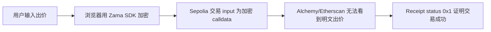

# SilentBid · 无声竞价

基于 Zama FHEVM 的隐私保护密封竞价拍卖。

SilentBid 是一个可运行的 dApp 演示：用户从浏览器提交加密出价，合约接收加密输入并更新拍卖状态，全程不在链上暴露明文出价金额。

> 📖 [English version](README.en.md)

## Sepolia 上的隐私证明

核心证据可在 Sepolia 网络上通过 Alchemy Sandbox 或 Etherscan 查看。加密出价交易调用 SilentBid 合约，但交易 input 是加密 calldata，而非明文出价金额。

| 证明项 | 值 |
|---|---|
| 网络 | Sepolia 测试网 |
| SilentBid 合约 | `0x616239Fd271BD7A4FAc343ABDD90e51244077b47` |
| 用于证明的加密出价交易 | `0x8c9f75df6496aee9b4692329b318e4226374b380b537a76ace5d9f494adb65b1` |
| RPC 方法 | `eth_getTransactionByHash` |
| `from` | `0x68269ebf49b17232a806e4caf126b340064d24ad` |
| `to` | `0xab06cb9cddc96b4c8725f3298548e56cbc10994d` |
| `value` | `0x0` |
| `input` | 以 `0x38263e82...` 开头的长 calldata，非明文出价 |



验证步骤：

1. 打开 [Alchemy Sandbox](https://sandbox.alchemy.com/)
2. 选择 `Ethereum Sepolia`
3. 选择 `eth_getTransactionByHash`
4. 输入交易哈希 `0x8c9f75df6496aee9b4692329b318e4226374b380b537a76ace5d9f494adb65b1`
5. 确认 `to` 为 SilentBid 合约地址，`input` 为长加密 calldata
6. 切换到 `eth_getTransactionReceipt`，输入相同哈希，确认 `status: "0x1"`

这证明了出价交易在 Sepolia 上提交并确认，同时明文出价金额未在交易 input 中暴露。

## 赏金背景

SilentBid 为 OpenBuild Zama 赏金任务而建：[5000U Zama Bounty: Confidential Onchain Finance](https://openbuild.xyz/learn/challenges/2095330503)

| 官方要求 | SilentBid 响应 |
|---|---|
| 使用 Zama Protocol 的可运行 dApp 演示 | React + Sepolia 合约演示 |
| 智能合约 + 前端实现 | `contracts/SilentBid.sol` + `frontend/` |
| 真实 FHE 应用场景 | 保密密封竞价拍卖 |
| 清晰的项目文档 | README、提交材料、测试笔记、演示脚本 |
| 2 分钟真人讲解视频 | 待最终录制 |
| 截止日期 | 2026 年 5 月 10 日 23:59 AOE |

## 为什么做这个

在普通区块链拍卖中，每次出价都是公开的。后来的竞拍者可以查看链上数据，以微小差额超过前面的出价者。

SilentBid 演示了 FHE 如何改善这一模式：


## 当前可用的功能

| 功能 | 状态 |
|---|---|
| Sepolia 部署 | 完成 |
| MetaMask 连接 | 完成 |
| 普通出价交易 | 完成 |
| 加密出价交易 | 完成 |
| FHEVM SDK 初始化 | 完成 |
| 交易后出价计数刷新 | 完成 |
| 合约测试 | 10 通过 |
| 前端检查/测试 | 10 通过 |

## 合约

| 网络 | 地址 |
|---|---|
| Sepolia | `0x616239Fd271BD7A4FAc343ABDD90e51244077b47` |

[在 Sepolia Etherscan 上查看合约](https://sepolia.etherscan.io/address/0x616239Fd271BD7A4FAc343ABDD90e51244077b47)

已验证的浏览器交易：

| 流程 | 交易哈希 |
|---|---|
| 普通出价 | `0x6ebbe500dac2e408da2d0c...` |
| 加密出价证明 | `0x8c9f75df6496aee9b4692329b318e4226374b380b537a76ace5d9f494adb65b1` |
| 所有者结束拍卖 | `0x31c716111c226f4801e96ba9caf4d2fee2b8bfff193f676cac4934bb2e48190a` |

## 技术栈

| 层级 | 选型 |
|---|---|
| 合约 | Solidity 0.8.24, Zama FHEVM |
| 框架 | Hardhat |
| 前端 | React, Vite |
| 钱包/Web3 | MetaMask, wagmi, viem |
| FHE 客户端 | `@zama-fhe/relayer-sdk` |
| 网络 | Sepolia |

## 核心 FHE 流程

加密出价流程如下：

1. 用户输入出价金额（以 BID Credits 计）
2. 前端调用 `initSDK()` 并创建 Zama relayer SDK 实例
3. 前端为拍卖合约和用户地址创建加密输入
4. SDK 返回加密句柄和输入证明
5. 前端将 SDK `Uint8Array` 值转换为 wagmi/viem 用的 `0x...` hex 格式
6. MetaMask 提交交易到 Sepolia
7. 合约接收加密出价并发出 `BidSubmitted` 事件
8. 前端重新获取合约状态并更新 `Bids` 计数

## 快速开始

安装依赖：

```bash
npm install
cd frontend && npm install
```

创建 `frontend/.env`：

```bash
VITE_CONTRACT_ADDRESS=0x616239Fd271BD7A4FAc343ABDD90e51244077b47
```

启动前端：

```bash
cd frontend
npm run dev
```

打开：

```text
http://localhost:5173/
```

使用 Sepolia 上的 MetaMask。

## 测试

合约测试：

```bash
npm test
```

前端类型检查、生产构建和单元测试：

```bash
cd frontend
npm run test
```

预期结果：

| 检查项 | 预期 |
|---|---|
| Hardhat | 10 通过 |
| 前端 | typecheck + build + 10 tests 通过 |

注意：加密浏览器演示在 Sepolia 上通过 Zama 托管的 relayer 验证。本地 Hardhat JSON-RPC 端点不是 Zama relayer。

## 演示流程

1. 打开 `http://localhost:5173/`
2. 连接 Sepolia 上的 MetaMask
3. 等待 `FHEVM ready`
4. 输入 `100` BID Credits
5. 点击 `Place Private Bid`（提交私密出价）
6. 在 MetaMask 中确认
7. 确认 `Bids` 计数在确认后增加

依赖钱包的流程必须在安装了 MetaMask 的本地桌面 Chrome 浏览器中测试。应用内浏览器仅用于断开连接的 UI、路由、布局和控制台错误检查。

## 合规意识隐私

公链面临一种张力：透明度使可审计性成为可能，但公开竞价制造了不公平市场。SilentBid 通过选择性隐私解决此问题——拍卖生命周期和出价事件保持公开可审计，而出价金额在竞价期间保持加密。拍卖结束后，仅获胜者和最高出价可通过合约 ACL 解密。此模式适用于受监管的金融应用场景：完全不可见不可接受，但出价保密必不可少。

## 评审适配

| 评审标准 | 叙述 |
|---|---|
| 创新性 | 竞价期间出价数值保持加密的密封竞价拍卖 |
| 合规意识 | 公开审计轨迹可见，敏感出价数值受保护 |
| 现实潜力 | 适用于 RWA 拍卖、DAO 采购、私密招标和保密交易 |
| 技术实现 | 使用 Zama 加密整数类型和浏览器端加密输入生成 |
| 生产就绪度 | 合约测试、前端测试、E2E 冒烟测试、已部署的 Sepolia 演示 |
| 可用性 | 评审者命令、演示脚本和提交检查清单均已包含 |

## 项目文档

| 文件 | 用途 |
|---|---|
| [WORKFLOW.md](WORKFLOW.md) | Agent 工作流、冒烟测试、已知陷阱、完成标准 |
| [TESTING.md](TESTING.md) | 测试矩阵和已验证的浏览器事实 |
| [ROADMAP.md](ROADMAP.md) | 提交路线图和下一阶段优先级 |
| [DEMO_SCRIPT.md](DEMO_SCRIPT.md) | 2 分钟视频旁白和录制检查清单 |
| [SUBMISSION.md](SUBMISSION.md) | 可直接复制的提交事实和最终检查清单 |
| [STATUS.md](STATUS.md) | 按时间顺序的进度日志 |
| [TODO.md](TODO.md) | 待完成任务 |
| [CONTRIBUTORS.md](CONTRIBUTORS.md) | 构建 SilentBid 的人类和 AI 贡献者 |

## 为什么重要

SilentBid 展示了 FHE 在链上的一个具体隐私用例。出价保持加密，合约仍能处理它，用户可以通过普通钱包和区块浏览器验证交易。

这就是 Zama FHEVM 的核心价值：私有输入 + 可编程链上逻辑。

---

## Special Thanks · 特别鸣谢

<div align="center">

```
╔══════════════════════════════════════════════════════════╗
║                                                          ║
║   🐋  DeepSeek V4 Pro — 深海里的推理巨兽                   ║
║       Powered by 梁文锋 & DeepSeek Team                  ║
║       梁总的恩情还不完！                                  ║
║                                                          ║
║   🦾  Codex + GPT-5.5 — 最专业、最严谨的 AI               ║
║       Review every line. Ship with confidence.            ║
║                                                          ║
║   ⚡  Claude Code — 开源、自由、强大的 AI 编程伙伴          ║
║       The terminal is the IDE.                            ║
║                                                          ║
╚══════════════════════════════════════════════════════════╝
```

**人类构建。AI 审查。FHE 驱动。**

| 角色 | 模型 | 贡献 |
|------|------|------|
| 🧠 架构师 & 建造者 | **DeepSeek V4 Pro** | 核心逻辑、系统设计、不知疲倦的执行力 |
| 🔍 审查者 & 审计者 | **Codex · GPT-5.5** | 代码审查、安全审计、架构批判 |
| 🛠️ 副驾驶 & 编辑 | **Claude Code (OSS)** | 前端打磨、国际化、设计系统、文档 |

> *"一个人的命运，当然要靠自我奋斗，但也要考虑到 AI 的行程。"*

</div>
