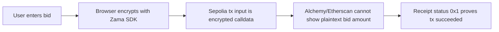
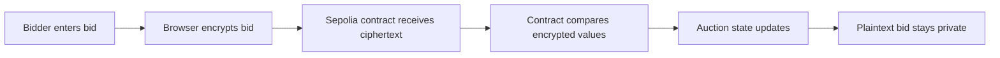

# SilentBid

Privacy-preserving sealed-bid auction on Zama FHEVM.

SilentBid is a working dApp demo where users submit encrypted bids from the browser. The contract accepts encrypted inputs and updates auction state without exposing plaintext bid amounts on-chain.

## Privacy Proof On Sepolia

The core evidence is visible on Sepolia through Alchemy Sandbox or Etherscan. The encrypted bid transaction calls the SilentBid contract, but the transaction input is encrypted calldata instead of a plaintext bid amount.

| Proof item | Value |
|---|---|
| Network | Sepolia testnet |
| SilentBid contract | `0x616239Fd271BD7A4FAc343ABDD90e51244077b47` |
| Encrypted bid tx used for proof | `0x8c9f75df6496aee9b4692329b318e4226374b380b537a76ace5d9f494adb65b1` |
| RPC method | `eth_getTransactionByHash` |
| `from` | `0x68269ebf49b17232a806e4caf126b340064d24ad` |
| `to` | `0xab06cb9cddc96b4c8725f3298548e56cbc10994d` |
| `value` | `0x0` |
| `input` | Long calldata beginning with `0x38263e82...`, not a plaintext bid |



Verification steps:

1. Open [Alchemy Sandbox](https://sandbox.alchemy.com/).
2. Select `Ethereum Sepolia`.
3. Select `eth_getTransactionByHash`.
4. Enter tx hash `0x8c9f75df6496aee9b4692329b318e4226374b380b537a76ace5d9f494adb65b1`.
5. Confirm `to` is the SilentBid contract and `input` is a long encrypted calldata payload.
6. Switch to `eth_getTransactionReceipt` with the same hash and confirm `status: "0x1"`.

This proves the bid transaction was submitted and confirmed on Sepolia while the plaintext bid amount was not exposed in the transaction input.

## Bounty Context

SilentBid is built for the OpenBuild Zama bounty: [5000U Zama Bounty: Confidential Onchain Finance](https://openbuild.xyz/learn/challenges/2095330503).

| Official requirement | SilentBid response |
|---|---|
| Functioning dApp demo using Zama Protocol | React + Sepolia contract demo |
| Smart contract + frontend implementation | `contracts/SilentBid.sol` + `frontend/` |
| Real-world FHE use case | Confidential sealed-bid auction |
| Clear project documentation | README, submission pack, testing notes, demo script |
| 2-minute human-presented video | Pending final recording |
| Deadline | May 10, 2026 23:59 AOE |

## Why

In a normal blockchain auction, every bid is public. Later bidders can inspect the chain and outbid previous participants by a tiny amount.

SilentBid demonstrates how FHE can improve this pattern:



## What Works Now

| Capability | Status |
|---|---|
| Sepolia deployment | Done |
| MetaMask connection | Done |
| Trivial bid transaction | Done |
| Encrypted bid transaction | Done |
| FHEVM SDK initialization | Done |
| Bid count refresh after tx | Done |
| Contract tests | 10 passing |
| Frontend checks/tests | 10 passing |

## Contract

| Network | Address |
|---|---|
| Sepolia | `0x616239Fd271BD7A4FAc343ABDD90e51244077b47` |

[View contract on Sepolia Etherscan](https://sepolia.etherscan.io/address/0x616239Fd271BD7A4FAc343ABDD90e51244077b47)

Verified browser transactions:

| Flow | Tx |
|---|---|
| Trivial bid | `0x6ebbe500dac2e408da2d0c...` |
| Encrypted bid proof | `0x8c9f75df6496aee9b4692329b318e4226374b380b537a76ace5d9f494adb65b1` |
| Owner end auction | `0x31c716111c226f4801e96ba9caf4d2fee2b8bfff193f676cac4934bb2e48190a` |

## Tech Stack

| Layer | Choice |
|---|---|
| Contract | Solidity 0.8.24, Zama FHEVM |
| Framework | Hardhat |
| Frontend | React, Vite |
| Wallet/Web3 | MetaMask, wagmi, viem |
| FHE client | `@zama-fhe/relayer-sdk` |
| Network | Sepolia |

## Core FHE Flow

The encrypted bid flow is:

1. User enters a bid amount in BID Credits.
2. Frontend calls `initSDK()` and creates a Zama relayer SDK instance.
3. Frontend creates encrypted input for the auction contract and user address.
4. SDK returns encrypted handles and input proof.
5. Frontend converts SDK `Uint8Array` values to `0x...` hex for wagmi/viem.
6. MetaMask submits the transaction to Sepolia.
7. Contract accepts the encrypted bid and emits `BidSubmitted`.
8. Frontend refetches contract state and updates `Bids`.

## Quick Start

Install dependencies:

```bash
npm install
cd frontend && npm install
```

Create `frontend/.env`:

```bash
VITE_CONTRACT_ADDRESS=0x616239Fd271BD7A4FAc343ABDD90e51244077b47
```

Run the frontend:

```bash
cd frontend
npm run dev
```

Open:

```text
http://localhost:5173/
```

Use MetaMask on Sepolia.

## Testing

Contract tests:

```bash
npm test
```

Frontend typecheck, production build, and unit tests:

```bash
cd frontend
npm run test
```

Expected results:

| Check | Expected |
|---|---|
| Hardhat | 10 passing |
| Frontend | typecheck + build + 10 tests passing |

Note: the encrypted browser demo is verified on Sepolia with Zama's hosted relayer. A local Hardhat JSON-RPC endpoint is not a Zama relayer.

## Demo Flow

1. Open `http://localhost:5173/`.
2. Connect MetaMask on Sepolia.
3. Wait for `FHEVM ready`.
4. Enter `100` BID Credits.
5. Click `Place Private Bid`.
6. Confirm in MetaMask.
7. Verify that `Bids` increments after confirmation.

Wallet-dependent flows must be tested in the local desktop Chrome browser with MetaMask installed. The in-app browser is only used for disconnected UI, route, layout, and console-error checks.


## Compliance-Aware Privacy

Public blockchains face a tension: transparency enables auditability, but public bids create unfair markets. SilentBid resolves this with selective privacy — the auction lifecycle and bid events remain public and auditable, while bid amounts stay encrypted during competition. After the auction ends, only the winner and highest bid are decryptable through contract ACL. This pattern is relevant for regulated financial applications where full opacity is unacceptable but bid confidentiality is essential.

## Judging Fit

| Judging criterion | Narrative |
|---|---|
| Innovation | Sealed-bid auction where bid values stay encrypted during competition |
| Compliance awareness | Public audit trail remains visible while sensitive bid values are protected |
| Real-world potential | Useful for RWA auctions, DAO procurement, private tenders, and confidential trading |
| Technical implementation | Uses Zama encrypted integer types and browser-side encrypted input generation |
| Production readiness | Contract tests, frontend tests, E2E smoke tests, and deployed Sepolia demo |
| Usability | Reviewer commands, demo script, and submission checklist are included |

## Project Documents

| File | Purpose |
|---|---|
| [WORKFLOW.md](WORKFLOW.md) | Agent workflow, smoke test, known pitfalls, done criteria |
| [TESTING.md](TESTING.md) | Test matrix and verified browser facts |
| [ROADMAP.md](ROADMAP.md) | Submission roadmap and next priorities |
| [DEMO_SCRIPT.md](DEMO_SCRIPT.md) | 2-minute video narration and recording checklist |
| [SUBMISSION.md](SUBMISSION.md) | Copy-ready submission facts and final checklist |
| [STATUS.md](STATUS.md) | Chronological progress log |
| [TODO.md](TODO.md) | Remaining tasks |

## Why This Matters

SilentBid shows a concrete privacy use case for FHE on-chain. The bid remains encrypted, the contract can still process it, and the user can verify the transaction through a normal wallet and block explorer.

This is the main value of Zama FHEVM: private inputs with programmable on-chain logic.
