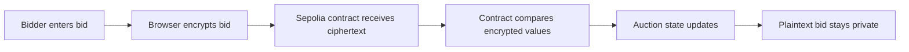

# SilentBid

Privacy-preserving sealed-bid auction on Zama FHEVM.

SilentBid is a working dApp demo where users submit encrypted bids from the browser. The contract accepts encrypted inputs and updates auction state without exposing plaintext bid amounts on-chain.

## Why

In a normal blockchain auction, every bid is public. Later bidders can inspect the chain and outbid previous participants by a tiny amount.

SilentBid demonstrates how FHE can improve this pattern:



## What Works Now

| Capability | Status |
|---|---|
| Sepolia deployment | Done |
| MetaMask connection | Done |
| Trivial bid transaction | Done |
| Encrypted bid transaction | Done |
| FHEVM SDK initialization | Done |
| Bid count refresh after tx | Done |
| Contract tests | 10 passing |
| Frontend checks/tests | 7 passing |

## Contract

| Network | Address |
|---|---|
| Sepolia | `0xAB06CB9cddC96B4c8725F3298548e56CbC10994d` |

[View contract on Sepolia Etherscan](https://sepolia.etherscan.io/address/0xAB06CB9cddC96B4c8725F3298548e56CbC10994d)

Verified browser transactions:

| Flow | Tx |
|---|---|
| Trivial bid | `0x6ebbe500dac2e408da2d0c...` |
| Encrypted bid | `0xfc54da826c251e17fc6ac6...` |

## Tech Stack

| Layer | Choice |
|---|---|
| Contract | Solidity 0.8.24, Zama FHEVM |
| Framework | Hardhat |
| Frontend | React, Vite |
| Wallet/Web3 | MetaMask, wagmi, viem |
| FHE client | `@zama-fhe/relayer-sdk` |
| Network | Sepolia |

## Core FHE Flow

The encrypted bid flow is:

1. User enters a bid amount in BID Credits.
2. Frontend calls `initSDK()` and creates a Zama relayer SDK instance.
3. Frontend creates encrypted input for the auction contract and user address.
4. SDK returns encrypted handles and input proof.
5. Frontend converts SDK `Uint8Array` values to `0x...` hex for wagmi/viem.
6. MetaMask submits the transaction to Sepolia.
7. Contract accepts the encrypted bid and emits `BidSubmitted`.
8. Frontend refetches contract state and updates `Bids`.

## Quick Start

Install dependencies:

```bash
npm install
cd frontend && npm install
```

Create `frontend/.env`:

```bash
VITE_CONTRACT_ADDRESS=0xAB06CB9cddC96B4c8725F3298548e56CbC10994d
```

Run the frontend:

```bash
cd frontend
npm run dev
```

Open:

```text
http://localhost:5173/
```

Use MetaMask on Sepolia.

## Testing

Contract tests:

```bash
npm test
```

Frontend typecheck, production build, and unit tests:

```bash
cd frontend
npm run test
```

Expected results:

| Check | Expected |
|---|---|
| Hardhat | 10 passing |
| Frontend | typecheck + build + 7 tests passing |

Note: the encrypted browser demo is verified on Sepolia with Zama's hosted relayer. A local Hardhat JSON-RPC endpoint is not a Zama relayer.

## Demo Flow

1. Open `http://localhost:5173/`.
2. Connect MetaMask on Sepolia.
3. Wait for `FHEVM ready`.
4. Enter `100` BID Credits.
5. Click `Place Private Bid`.
6. Confirm in MetaMask.
7. Verify that `Bids` increments after confirmation.

## Project Documents

| File | Purpose |
|---|---|
| [WORKFLOW.md](WORKFLOW.md) | Agent workflow, smoke test, known pitfalls, done criteria |
| [TESTING.md](TESTING.md) | Test matrix and verified browser facts |
| [ROADMAP.md](ROADMAP.md) | Submission roadmap and next priorities |
| [DEMO_SCRIPT.md](DEMO_SCRIPT.md) | 2-minute video narration and recording checklist |
| [SUBMISSION.md](SUBMISSION.md) | Copy-ready submission facts and final checklist |
| [STATUS.md](STATUS.md) | Chronological progress log |
| [TODO.md](TODO.md) | Remaining tasks |

## Why This Matters

SilentBid shows a concrete privacy use case for FHE on-chain. The bid remains encrypted, the contract can still process it, and the user can verify the transaction through a normal wallet and block explorer.

This is the main value of Zama FHEVM: private inputs with programmable on-chain logic.
