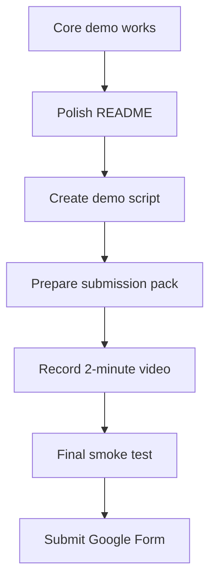

# SilentBid Roadmap

## Submission Target

Deliver a clean Zama bounty submission:

| Asset | Status | Owner |
|---|---|---|
| Smart contract | Done | Project |
| Sepolia deployment | Done | Project |
| Frontend demo | Done | Project |
| Encrypted bid browser proof | Done | Codex |
| README | Done | Codex |
| Demo script | Done | Codex |
| Submission pack | Done | Codex |
| Demo video | Pending | Human |
| Google Form | Pending | Human |

## Priority Plan

## P0: Submission Blockers

| Task | Acceptance |
|---|---|
| Final README pass | Contract address, commands, demo flow, screenshots/tx evidence are accurate |
| Demo script | `DEMO_SCRIPT.md` can be read in about 2 minutes |
| Final Chrome smoke | `Bid (encrypted)` still reaches MetaMask and increments `Bids` |
| Submission checklist | `SUBMISSION.md` has repo, video, contract, and tx links gathered before submit |

## P1: Quality Improvements

| Task | Why |
|---|---|
| Add mocked EIP-1193 e2e | Prevent wallet-flow regressions without relying on MetaMask |
| Add connected-state component tests | Cover owner controls, invalid bid amount, disabled states |
| Improve UI layout | Make the demo more readable in a video |
| Add Etherscan links for tx/address | Easier judging and debugging |

## P2: Stretch Ideas

| Idea | Benefit |
|---|---|
| Reveal winner flow UI | Better auction narrative |
| Countdown/end-time display | Makes auction state clearer |
| Bid history event panel | Shows on-chain activity without revealing amounts |
| One-click copy tx/address | Useful for judges |

## Demo Narrative

| Beat | Message |
|---|---|
| Problem | Public blockchain bids can be copied or outbid |
| Solution | Encrypt bids before sending them on-chain |
| Zama value | Contract compares encrypted bids using FHE |
| Proof | Browser encrypts, MetaMask confirms, Sepolia contract accepts |
| Result | Bid count increments while bid amount remains private |

## Final Release Checklist

| Check | Command/Action |
|---|---|
| Contract tests | `npm test` |
| Frontend checks | `cd frontend && npm run test` |
| Browser smoke | Chrome + MetaMask + Sepolia |
| Docs current | `README.md`, `WORKFLOW.md`, `TESTING.md`, `STATUS.md` |
| Submission material | Video, repo link, contract link, tx link |

## New Documents

| File | Purpose |
|---|---|
| `DEMO_SCRIPT.md` | Exact 2-minute narration and screen recording checklist |
| `SUBMISSION.md` | Copy-ready submission facts, links, evidence, and reviewer commands |
