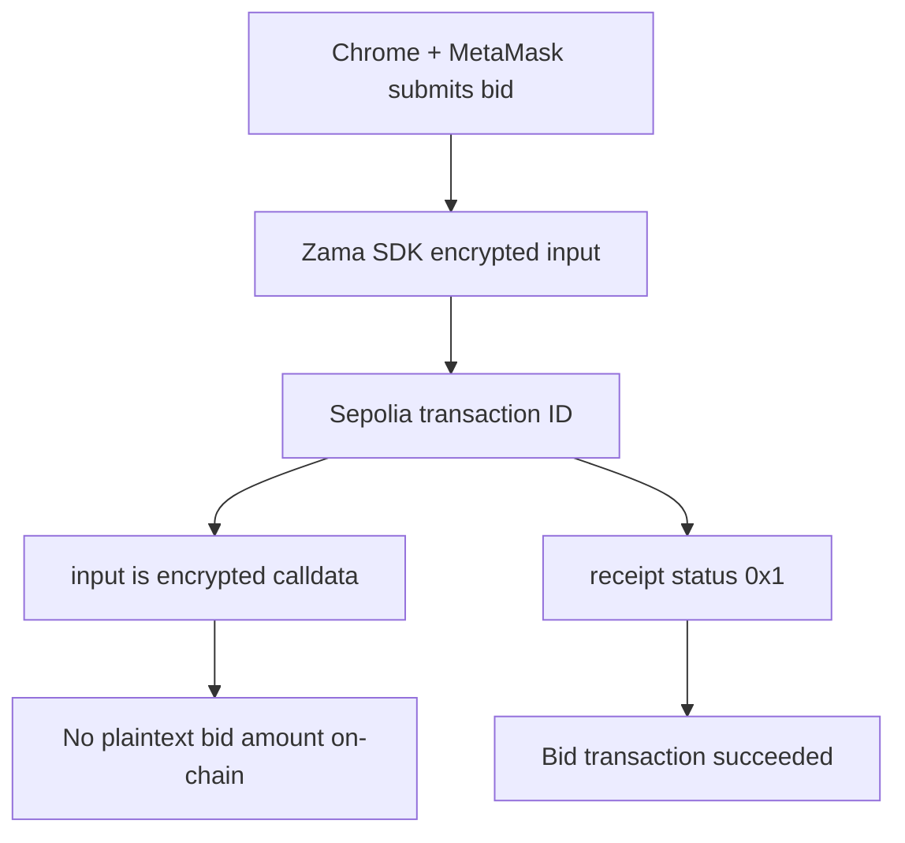

# SilentBid Submission Pack

## Core Links

| Item | Value |
|---|---|
| Project name | SilentBid |
| One-liner | Privacy-preserving sealed-bid auction on Zama FHEVM |
| Official bounty | https://openbuild.xyz/learn/challenges/2095330503 |
| Submission deadline | May 10, 2026 23:59 AOE |
| Submission form | https://forms.gle/h2vdBaZ9zwmLVzeu5 |
| Sepolia contract | `0xCE06943bF0A1a5bfb409e50b00466abb6fc24F85` |
| Explorer | https://sepolia.etherscan.io/address/0xCE06943bF0A1a5bfb409e50b00466abb6fc24F85 |
| Transaction evidence | Copy the latest wallet transaction ID from the on-chain evidence panel |
| Verification tool | https://sandbox.alchemy.com/ |
| Local demo URL | `http://localhost:5173/` |

## Most Important Proof: Bid Amount Is Not Public

Use this proof first in the README, demo, and judge walkthrough.

| Step | Evidence |
|---|---|
| Query transaction | `eth_getTransactionByHash` on Ethereum Sepolia |
| Transaction hash | Copy from the SilentBid on-chain evidence panel after submitting a bid |
| Contract | `to: 0xCE06943bF0A1a5bfb409e50b00466abb6fc24F85` |
| ETH value | `value: 0x0` for bid calls |
| Transaction input | Long calldata, not a readable plaintext bid |
| Privacy conclusion | The chain sees encrypted calldata and proof data, not the plaintext bid amount |
| Success proof | `eth_getTransactionReceipt` returns `status: 0x1` for the same transaction |



Copy-ready proof statement:

> On Sepolia, a SilentBid transaction calls the current demo contract with `value: 0x0` and a long calldata payload. The plaintext bid amount is not visible in the transaction input or logs, while the receipt confirms success with `status: 0x1`. Reviewers can copy the latest wallet transaction ID directly from the demo's on-chain evidence panel and verify it in Alchemy Sandbox.

## Short Description

SilentBid is a sealed-bid auction dApp where users submit encrypted bids from the browser. The smart contract uses Zama FHEVM primitives to compare encrypted bids without revealing the plaintext bid amounts. This prevents public bid sniping while preserving on-chain verifiability.

## Copy-Ready Form Answers

| Field | Draft |
|---|---|
| Project name | SilentBid |
| Tagline | Privacy-preserving sealed-bid auction on Zama FHEVM |
| Short summary | SilentBid lets users submit encrypted bids from the browser. The Sepolia smart contract processes encrypted bid inputs using Zama FHEVM, so bids can affect auction state without exposing plaintext amounts. |
| Problem | Public on-chain auctions reveal every bid, which lets later bidders copy or slightly outbid earlier participants. |
| Solution | Encrypt each bid client-side with the Zama relayer SDK, submit the encrypted input to the contract, and update auction state using FHE-compatible logic. |
| Zama usage | The app uses Zama FHEVM contracts and `@zama-fhe/relayer-sdk` to create encrypted inputs in the browser and submit them to Sepolia. |
| Demo proof | In Chrome with MetaMask on Sepolia, an encrypted bid transaction was confirmed and the UI bid count updated from 1 to 2. |

## Longer Description

SilentBid demonstrates a practical use case for fully homomorphic encryption in blockchain applications. In normal on-chain auctions, every bid is public, so later bidders can inspect existing bids and slightly outbid competitors. SilentBid changes this flow: the frontend encrypts a user's bid with the Zama relayer SDK, submits the encrypted input to a Sepolia smart contract, and the contract updates auction state using FHE operations.

The working demo proves the full path: Zama SDK initialization, encrypted input creation, MetaMask confirmation, Sepolia transaction submission, event observation, and UI state refresh.

## Technical Highlights

| Area | Detail |
|---|---|
| FHE primitive | Encrypted bid comparison with Zama FHEVM |
| Frontend encryption | `@zama-fhe/relayer-sdk` in React |
| Wallet | MetaMask on Sepolia |
| Contract framework | Hardhat |
| Frontend stack | React, wagmi, viem, Vite |
| Test coverage | 10 contract tests, 10 frontend tests |

## Official Requirement Mapping

| OpenBuild requirement | Status | Evidence |
|---|---|---|
| Functioning dApp demo using Zama Protocol | Ready | Local frontend + Sepolia contract |
| Real-world FHE use case | Ready | Confidential sealed-bid auction |
| Smart contract implementation | Ready | `contracts/SilentBid.sol` |
| Frontend implementation | Ready | `frontend/` React app |
| Clear project documentation | Ready | README, TESTING, WORKFLOW, ROADMAP, SUBMISSION |
| 2-minute human-presented demo video | Pending | Must record with real person on camera |


## Compliance-Aware Privacy Model

SilentBid demonstrates a compliance-friendly privacy architecture: the auction lifecycle is publicly auditable (when bids were submitted, how many, by whom), while the bid amounts remain encrypted throughout competition. This is selective privacy, not opacity — regulators and auditors can verify that the auction was fair, but competitors cannot see each other's bids.

| Layer | Public | Encrypted |
|---|---|---|
| Bid submission event | bidder address, timestamp, tx hash | bid amount |
| Auction status | active/ended, bid count, owner address | current highest bid |
| Winner identity | encrypted during auction | decryptable only after end via ACL |
| Highest bid | encrypted during auction | decryptable only after end via ACL |

This pattern directly addresses the tension between blockchain transparency and financial privacy — a key concern for institutional adoption of on-chain finance.

## Judging Criteria Positioning

| Criterion | Talking point |
|---|---|
| Innovation | SilentBid turns sealed bidding into a programmable on-chain workflow without public bid leakage. |
| Compliance awareness | The design separates public audit data from confidential bid values, enabling selective privacy rather than opacity. |
| Real-world potential | Applicable to RWA auctions, DAO procurement, grant allocation, private tenders, and confidential trading. |
| Technical implementation | Uses FHE.select (encrypted conditional) for branchless highest-bid tracking, euint32 for bid amounts, and ACL-based selective decryption. The contract never branches on plaintext bid values. |
| Production readiness | Contract, frontend, and E2E smoke tests are documented and passing. |
| Usability | The demo has a concise reviewer flow and a 2-minute script. |

## Evidence

| Evidence | Status |
|---|---|
| Contract tests | Passing |
| Frontend typecheck/build/tests | Passing |
| Sepolia browser smoke | Passing |
| Wallet transaction ID | Displayed in the demo's on-chain evidence panel after a SilentBid transaction |
| Encrypted bid calldata privacy | Verifiable via Alchemy Sandbox `eth_getTransactionByHash` |
| Encrypted bid receipt | Verifiable via Alchemy Sandbox `eth_getTransactionReceipt`, `status: 0x1` |
| Bid count refresh | Verified from `1` to `2` |

## Manual Chrome / MetaMask Boundary

Wallet-dependent flows cannot be validated in the in-app browser because it cannot install MetaMask.

| Flow | Test location |
|---|---|
| Page load, disconnected state, routing, console errors | In-app browser |
| MetaMask connect, chain switch, signatures, bid transactions, end auction | Local desktop Chrome with MetaMask |
| Final submission smoke | Local desktop Chrome with MetaMask |

## Closed Auction Follow-Up

After the owner closes the auction, the demo should show or explain:

| Step | Expected proof |
|---|---|
| Confirm closed state | UI shows Closed/Ended or contract `ended == true` |
| Confirm bid count | `bidCount` remains public and auditable |
| Explain privacy boundary | Losing bid values remain private |
| Explain result model | Winner/highest bid handles are only decryptable after auction end via contract ACL |
| Record final clip | Show closed state and explain ACL-based result decryption |

## Commands For Reviewers

```bash
npm install
npm test

cd frontend
npm install
npm run test
npm run dev
```

Create `frontend/.env`:

```bash
VITE_CONTRACT_ADDRESS=0xCE06943bF0A1a5bfb409e50b00466abb6fc24F85
```

## Final Submission Checklist

| Item | Status |
|---|---|
| GitHub repository link | Needs repo creation |
| Contract explorer link | Ready |
| 2-minute video link | Pending recording |
| README updated | Ready |
| Tests passing | Verified 2026-05-07 (10 contract + 10 frontend + 12 E2E) |
| Decryption gate fix | Done (require ended) |
| Official bounty mapping | Ready |
| Chrome + MetaMask wallet smoke | Pending final manual pass |
| Final Chrome smoke before submit | Pending |
| Google Form submitted | Pending |
