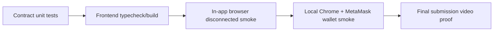

# Testing Matrix

## Current coverage

| Layer | Command | Status | Notes |
|---|---|---|---|
| Contracts | `npm test` | Passing | 10 Hardhat tests cover deploy, trivial bids, auction end, encrypted handle existence |
| Frontend static/unit | `cd frontend && npm run test` | Passing | Runs TypeScript typecheck, production build, and 10 vitest tests |
| Browser smoke | Manual Chrome + MetaMask | Passing | Sepolia `Bid (trivial)` and `Bid (encrypted)` produced tx/event; `Bids` refreshed |
| Relayer keyurl | `curl -fsSL https://relayer.testnet.zama.org/v2/keyurl` | Passing | Returns public key and CRS JSON |
| Encrypted bid e2e | Manual Chrome + MetaMask | Passing | Encrypted bid tx `0x8c9f75df...65b1`; calldata privacy verified; `Bids` updated |
| Sepolia RPC proof | Alchemy Sandbox | Passing | `eth_getTransactionByHash` shows encrypted calldata, receipt shows `status: 0x1` |
| In-app browser route smoke | Codex in-app browser | Passing | Disconnected UI/routes/console checks only; no MetaMask support |

## Browser Testing Boundary

| Flow | Test surface | Reason |
|---|---|---|
| Page load, disconnected state, route rendering, console errors | Codex in-app browser | Does not require wallet extension |
| Connect wallet, switch network, sign, send transaction | Local desktop Chrome + MetaMask | Requires installed wallet extension |
| Place encrypted bid | Local desktop Chrome + MetaMask | Requires FHEVM SDK + wallet transaction |
| End auction | Local desktop Chrome + MetaMask owner account | Requires owner wallet transaction |
| Closed auction verification | Chrome for wallet state, in-app browser for disconnected display | Chain state can be read without wallet, but owner actions require MetaMask |

## Verified browser facts

- URL: `http://localhost:5173/`
- Wallet: MetaMask test account `0x6826...24ad`
- Network: Sepolia
- Trivial bid tx: `0x6ebbe500dac2e408da2d0c...`
- Encrypted bid tx privacy proof: `0x8c9f75df6496aee9b4692329b318e4226374b380b537a76ace5d9f494adb65b1`
- Owner end auction tx: `0x31c716111c226f4801e96ba9caf4d2fee2b8bfff193f676cac4934bb2e48190a`
- Observed event: `BidSubmitted` from `0x68269e...`
- Balance after gas: about `4.049 SepoliaETH`
- Observed bid count after encrypted bid: `2`

## Alchemy Sandbox Privacy Proof

| Query | Expected evidence |
|---|---|
| `eth_getTransactionByHash` with `0x8c9f75df6496aee9b4692329b318e4226374b380b537a76ace5d9f494adb65b1` | `to` is SilentBid contract, `value` is `0x0`, `input` is long encrypted calldata beginning with `0x38263e82...` |
| `eth_getTransactionReceipt` with the same tx hash | `status` is `0x1`, `logs` are present, transaction is included in block `0xa4e156` |
| `eth_getTransactionByHash` with `0x31c716111c226f4801e96ba9caf4d2fee2b8bfff193f676cac4934bb2e48190a` | Owner close transaction, `input` is `0xfe67a54b` for `endAuction()` |

This is the evidence chain used in the final demo: encrypted bid transaction details prove the plaintext bid amount is not visible, and the receipt proves the transaction succeeded.

## Known gaps

- Add frontend unit tests for connected/disconnected rendering.
- Add automated e2e for connected wallet or a mocked EIP-1193 wallet.
- Run one final local Chrome + MetaMask smoke before submission after the auction-close flow is documented.
