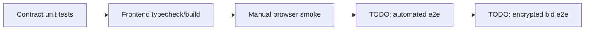

# Testing Matrix

## Current coverage

| Layer | Command | Status | Notes |
|---|---|---|---|
| Contracts | `npm test` | Passing | 10 Hardhat tests cover deploy, trivial bids, auction end, encrypted handle existence |
| Frontend static/unit | `cd frontend && npm run test` | Passing | Runs TypeScript typecheck, production build, and 7 vitest tests |
| Browser smoke | Manual Chrome + MetaMask | Passing | Sepolia `Bid (trivial)` and `Bid (encrypted)` produced tx/event; `Bids` refreshed |
| Relayer keyurl | `curl -fsSL https://relayer.testnet.zama.org/v2/keyurl` | Passing | Returns public key and CRS JSON |
| Encrypted bid e2e | Manual Chrome + MetaMask | Passing | Encrypted bid tx `0xfc54da826c251e17fc6ac6...`; `Bids` updated from 1 to 2 |

## Verified browser facts

- URL: `http://localhost:5173/`
- Wallet: MetaMask test account `0x6826...24ad`
- Network: Sepolia
- Trivial bid tx: `0x6ebbe500dac2e408da2d0c...`
- Encrypted bid tx: `0xfc54da826c251e17fc6ac6...`
- Observed event: `BidSubmitted` from `0x68269e...`
- Balance after gas: about `4.049 SepoliaETH`
- Observed bid count after encrypted bid: `2`

## Known gaps

- Add frontend unit tests for connected/disconnected rendering.
- Add automated e2e for connected wallet or a mocked EIP-1193 wallet.
