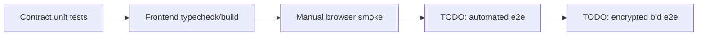

# Testing Matrix

## Current coverage

| Layer | Command | Status | Notes |
|---|---|---|---|
| Contracts | `npm test` | Passing | 10 Hardhat tests cover deploy, trivial bids, auction end, encrypted handle existence |
| Frontend static | `cd frontend && npm test` | Passing | Runs TypeScript typecheck and production build |
| Browser smoke | Manual Chrome + MetaMask | Partial | Sepolia `Bid (trivial)` produced tx/event, but `Bids` UI did not refresh |
| Encrypted bid e2e | Manual Chrome + MetaMask | Failing | FHEVM SDK cannot fetch relayer public key yet |

## Verified browser facts

- URL: `http://localhost:5173/`
- Wallet: MetaMask test account `0x6826...24ad`
- Network: Sepolia
- Trivial bid tx: `0x6ebbe500dac2e408da2d0c...`
- Observed event: `BidSubmitted` from `0x68269e...`
- Balance after gas: about `4.049 SepoliaETH`

## Known gaps

- Add frontend unit tests for connected/disconnected rendering.
- Add automated e2e for connect wallet -> bid trivial -> tx hash/event -> bid count refresh.
- Fix or explicitly refetch `bidCount` after successful transaction.
- Fix FHEVM relayer/public key initialization before claiming encrypted bid support.
