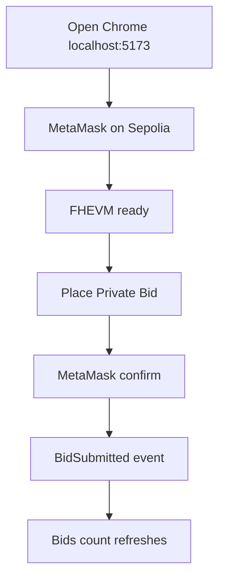
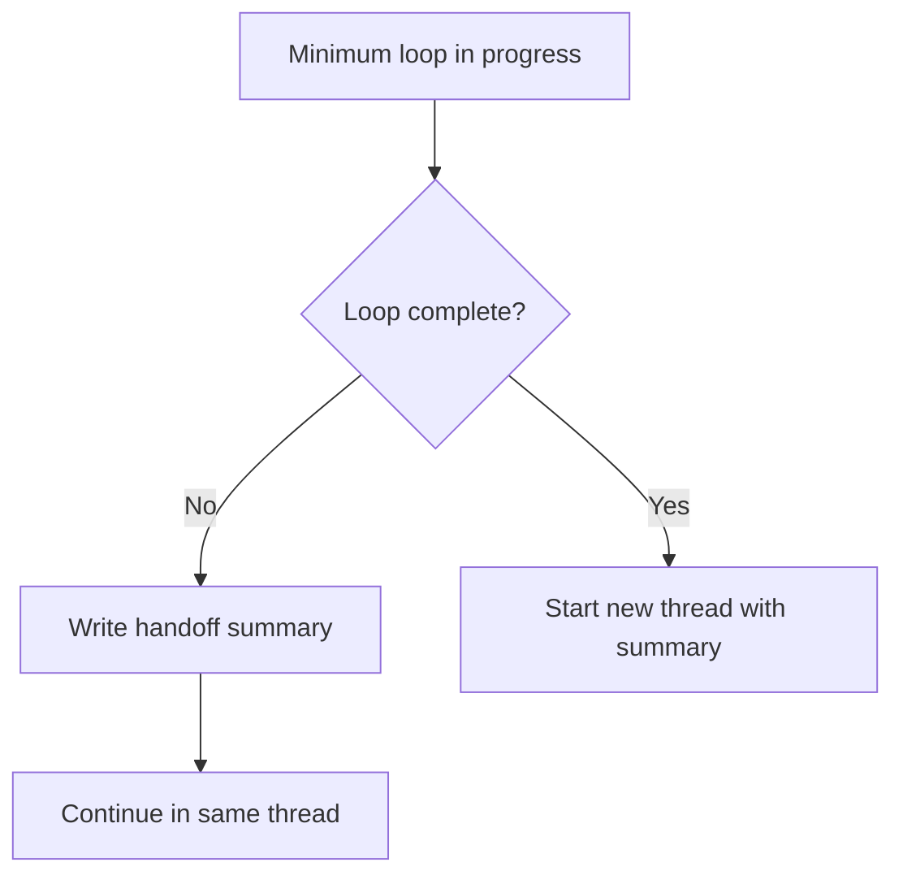

# SilentBid Workflow

This document is the operating guide for agents working on SilentBid.

## Current Goal

SilentBid must stay demo-ready on Sepolia:



## Responsibilities

| Owner | Scope | Rule |
|---|---|---|
| Codex | Review, frontend fixes, tests, Chrome verification, docs | Verify edge cases before marking done |
| Claude/Hermes | Fast implementation, task queue, deployment notes | Do not mark browser flows done without evidence |
| Human | Product direction, final video, form submission | Can approve testnet wallet actions broadly |

## Golden Path

1. Read `STATUS.md`, `TODO.md`, and `TESTING.md`.
2. Make the smallest code change that advances the current blocker.
3. Run contract and frontend checks.
4. Verify `http://localhost:5173/` in real Chrome when MetaMask is involved.
5. Record facts in `STATUS.md`, update `TODO.md`, and update `TESTING.md`.

## Verification Commands

```bash
npm test
cd frontend && npm run test
```

Expected result:

| Layer | Expected |
|---|---|
| Hardhat | 10 passing |
| Frontend | typecheck + build + 7 vitest tests passing |

## Browser Smoke Test

Use real Chrome for wallet flows.

| Step | Expected |
|---|---|
| Open `http://localhost:5173/` | App loads |
| Connect MetaMask on Sepolia | Account shown |
| Wait for FHEVM | `FHEVM ready` |
| Click `Place Private Bid` | MetaMask transaction request opens |
| Confirm | Transaction hash appears |
| Wait for confirmation | `Bids` increments |

Current verified tx:

| Flow | Tx |
|---|---|
| Trivial bid | `0x6ebbe500dac2e408da2d0c...` |
| Encrypted bid | `0xfc54da826c251e17fc6ac6...` |

## Known Pitfalls

| Symptom | Cause | Fix |
|---|---|---|
| `__wbindgen_malloc` | SDK wasm not initialized | Call `initSDK()` before `createInstance()` |
| `/v2` opens as error page | It is an API root, not a website | Verify `/v2/keyurl` instead |
| `hex_.replace is not a function` | Passing `Uint8Array` into viem contract args | Convert `handles/inputProof` with `toHex()` |
| `Bids` does not update | Query invalidation missed wagmi read keys | Explicitly refetch contract reads after tx confirmation |
| Localhost RPC used as relayer | `http://localhost:8545` is not a Zama relayer | Use Sepolia `SepoliaConfigV2` for encrypted browser demo |

## Context Management

If context becomes heavy:



Only set a 5-hour follow-up if usage is nearly exhausted and the current minimum loop is unfinished.

## Definition Of Done

A task is done only when all relevant boxes are true:

| Check | Required |
|---|---|
| Code compiles | Yes |
| Tests pass | Yes |
| Browser wallet flow verified if affected | Yes |
| `STATUS.md` updated | Yes |
| `TODO.md` updated | Yes |
| Edge-case risk reviewed | Yes |
