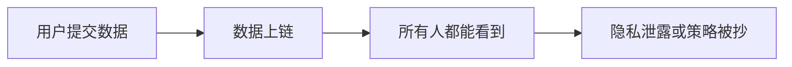
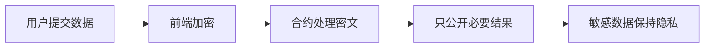
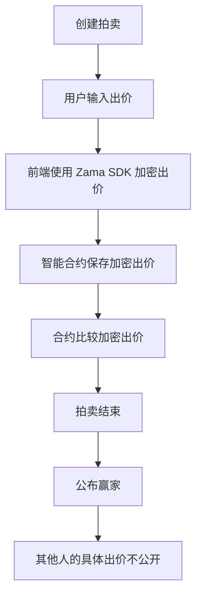
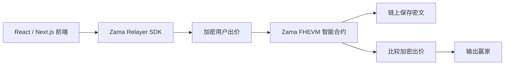
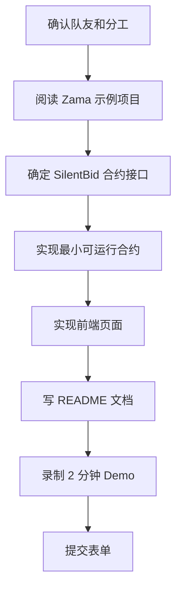
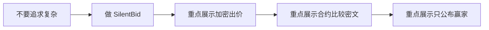

# Zama Bounty 黑客松项目理解与方案

## 1. 原始比赛要求

老师给到的信息可以整理为：

| 项目 | 要求 |
|---|---|
| 报名入口 | https://openbuild.xyz/learn/challenges/2095330503 |
| 项目提交 | https://forms.gle/h2vdBaZ9zwmLVzeu5 |
| 总奖励 | 5,000 cUSDT |
| 获奖项目数 | 5 个 |
| 单个项目奖励 | 1,000 cUSDT |
| 截止时间 | 5 月 10 日 23:59，AOE 时间 |
| 技术要求 | 基于 Zama Protocol 的可运行 dApp Demo |
| 核心展示 | 展示 FHE 在真实场景中的应用价值 |
| 交付内容 | 智能合约 + 前端实现 + 项目文档 + 2 分钟视频 Demo |
| 视频要求 | 必须真人出镜讲解，不接受 AI 生成视频、虚拟形象或合成语音 |

## 2. 这个题目到底是什么意思

一句话解释：

> 做一个区块链应用，但是应用里的敏感数据要保持加密，同时智能合约还能对这些加密数据进行计算。

普通区块链的问题：

Zama / FHE 想解决的问题：

FHE 的核心理解：

> Fully Homomorphic Encryption，全同态加密。简单理解就是：数据一直是加密的，但系统仍然可以对它做计算。

这次黑客松不是要求我们发明密码学算法，而是要求我们使用 Zama 提供的工具，做一个能跑的隐私 dApp Demo。

## 3. 可选项目方向

| 项目方向 | 难度 | 展示效果 | 推荐程度 |
|---|---:|---:|---:|
| 隐私投票 dApp | 低 | 清楚直接 | 高 |
| 密封竞价拍卖 | 中 | 非常贴合 FHE | 最高 |
| 隐私问卷 / 隐私评分 | 低 | 容易讲清楚 | 高 |
| 隐私石头剪刀布 | 中 | 有趣但略偏游戏 | 中 |
| 隐私 DeFi | 高 | 看起来高级但风险大 | 不建议 |

## 4. 推荐项目：密封竞价拍卖

推荐项目名：

| 语言 | 名称 |
|---|---|
| 英文 | SilentBid |
| 中文 | 基于 Zama FHEVM 的隐私密封竞价拍卖 |

项目一句话：

> SilentBid is a privacy-preserving sealed-bid auction dApp built with Zama FHEVM, where users can submit encrypted bids and the smart contract can determine the winner without revealing all bid values.

中文解释：

> 这是一个隐私拍卖 dApp。用户提交的出价会先被加密，合约可以在不公开出价的情况下比较谁的出价最高，最后只公布赢家，保护其他人的出价隐私。

## 5. 为什么这个项目适合黑客松

| 优点 | 说明 |
|---|---|
| 场景真实 | 拍卖天然需要隐藏出价 |
| FHE 价值明确 | 加密状态下比较大小，非常适合展示 FHE |
| 功能边界清楚 | 提交出价、查看状态、结束拍卖、公布赢家 |
| 视频好讲 | 2 分钟内可以讲明白问题、方案和 Demo |
| 难度可控 | 不需要设计复杂经济模型 |

核心流程：

## 6. MVP 功能范围

建议只做黑客松够用的版本：

| 模块 | 功能 |
|---|---|
| 智能合约 | 创建拍卖、提交加密出价、比较最高价、结束拍卖、读取赢家 |
| 前端 | 连接钱包、输入出价、提交出价、显示拍卖状态、显示赢家 |
| 文档 | 项目介绍、问题背景、技术架构、使用方法、Demo 流程 |
| 视频 | 真人出镜介绍 + 屏幕录制演示 |

不建议第一版做：

| 不建议功能 | 原因 |
|---|---|
| 多个拍卖市场 | 增加前端和合约复杂度 |
| 真实 NFT 交易 | 容易引入额外合约风险 |
| 复杂押金机制 | 调试成本高 |
| 复杂 DeFi 收益逻辑 | 跑偏主题 |

## 7. 技术结构草图

可能的技术栈：

| 层 | 选择 |
|---|---|
| 前端 | React 或 Next.js |
| 钱包 | MetaMask / RainbowKit / wagmi |
| 合约 | Solidity + Zama FHEVM |
| 开发框架 | Hardhat |
| 文档 | README.md |
| 视频 | 真人出镜 + 屏幕录制 + 英文字幕 |

## 8. Demo 视频结构

建议 2 分钟视频这样分配：

| 时间 | 内容 | 形式 |
|---:|---|---|
| 0:00-0:20 | 真人出镜介绍项目和问题 | 真人出镜 |
| 0:20-0:45 | 说明为什么普通链上拍卖不隐私 | 真人或旁白 |
| 0:45-1:30 | 屏幕演示提交加密出价和查看状态 | 屏幕录制 |
| 1:30-1:50 | 展示拍卖结束，只公布赢家 | 屏幕录制 |
| 1:50-2:00 | 总结 FHE 价值 | 真人出镜 |

推荐使用英文讲解，英文字幕。口语不需要复杂，清楚就行。

## 9. 英文视频讲稿初稿

> Hi everyone, we are building SilentBid, a privacy-preserving sealed-bid auction using Zama FHEVM.
>
> In a normal blockchain auction, all bids are visible on-chain. This creates an unfair situation, because later users can see existing bids and slightly outbid others.
>
> With Zama, each bid is encrypted before it is sent to the smart contract. The contract can compare encrypted bids without revealing the actual bid values.
>
> In this demo, I connect my wallet, enter a bid, encrypt it, and submit it to the auction contract. The bid is stored as encrypted data.
>
> After multiple users submit their bids, the contract determines the highest bidder. At the end, the app only reveals the winner, while the losing bid amounts remain private.
>
> This shows how FHE can bring real privacy to blockchain applications, while still keeping the logic verifiable and programmable.
>
> Thank you for watching our demo.

## 10. 中文理解版讲稿

大家好，我们的项目叫 SilentBid，是一个基于 Zama FHEVM 的隐私密封竞价拍卖应用。

普通区块链拍卖有一个明显问题：所有出价都在链上公开，后出价的人可以看到前面的价格，然后只多出一点点来赢得拍卖，这对其他参与者不公平。

我们的方案是让用户在前端先加密出价，然后再提交到智能合约。智能合约可以在不解密具体金额的情况下，比较谁的出价最高。

在 Demo 中，用户连接钱包，输入出价，加密并提交。合约保存的是密文，不是公开金额。拍卖结束后，应用只公布赢家，而不会公开所有失败者的具体出价。

这个项目展示了 FHE 在真实区块链场景里的价值：既能保护隐私，又能让智能合约继续执行有用的计算逻辑。

## 11. 接下来行动计划

建议分工：

| 角色 | 任务 |
|---|---|
| 合约同学 | 研究 Zama FHEVM 示例，写拍卖合约 |
| 前端同学 | 做连接钱包、输入出价、提交交易、展示结果 |
| 文档同学 | 写 README、整理项目架构和 Demo 步骤 |
| 演示同学 | 录制真人视频和屏幕 Demo |

如果人少，可以这样压缩：

| 人数 | 分工 |
|---:|---|
| 1 人 | 先跑通 Zama 示例，再改成拍卖 |
| 2 人 | 一人合约，一人前端 + 文档 + 视频 |
| 3 人 | 合约、前端、文档视频各一人 |

## 12. 当前结论

最建议的路线：

评审最需要看到的不是项目有多大，而是：

| 评审点 | 我们如何满足 |
|---|---|
| 使用 Zama Protocol | 合约使用 Zama FHEVM 加密类型和操作 |
| 有真实场景 | 密封竞价拍卖天然需要隐私 |
| 有智能合约 | 实现加密出价和赢家判断 |
| 有前端 | 用户可以连接钱包并提交出价 |
| 有完整文档 | README 说明背景、架构、运行方式 |
| 有真人视频 | 英文讲解 + 屏幕 Demo + 字幕 |

